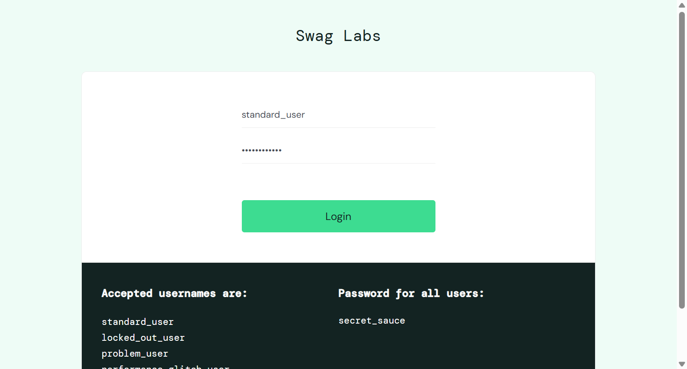
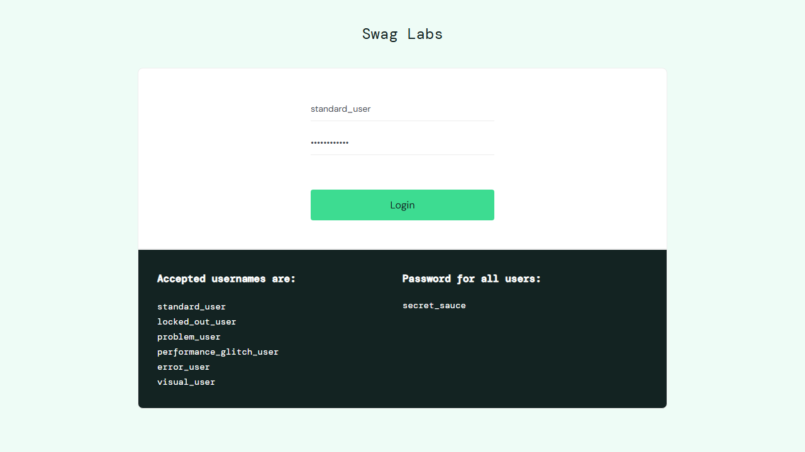
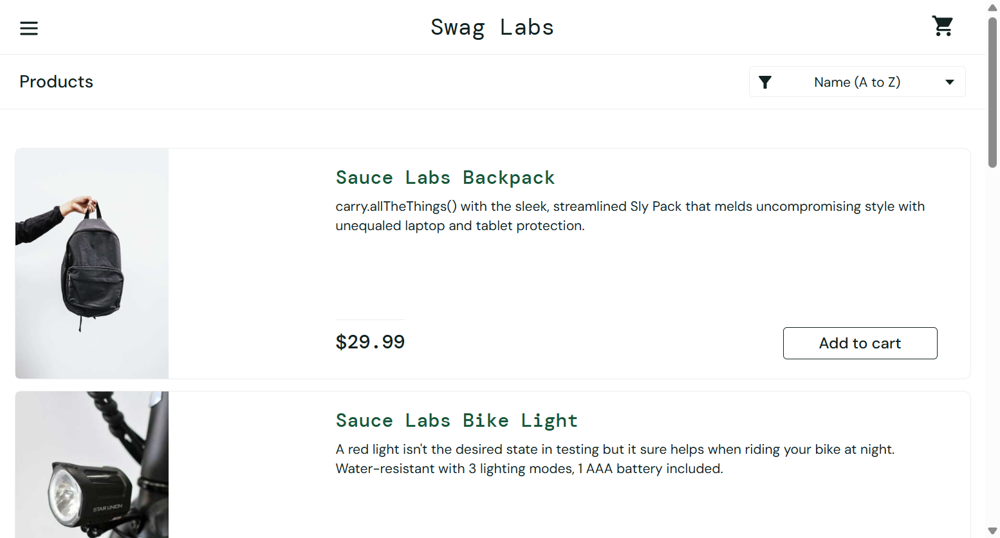
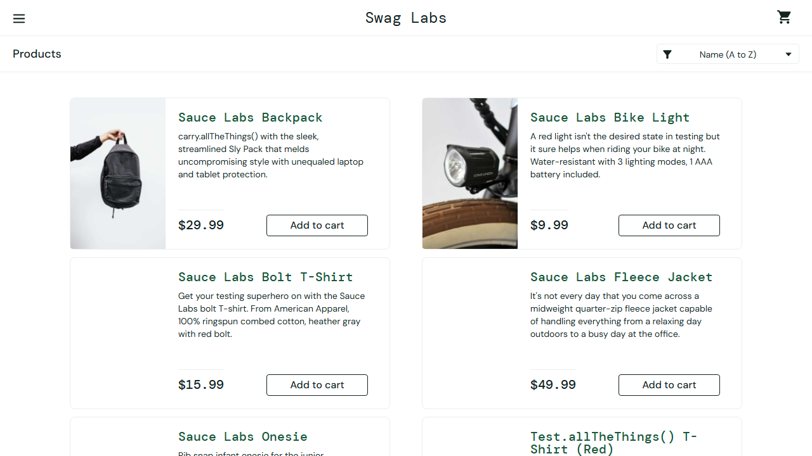

# Migration Evidence Report — LoginFlow DEMO fixture (UiPath -> Playwright) -- NOT the real project, see uipath-playwright-dm for that

> Generated by `uipath-to-playwright/scripts/build_evidence_report.py`

> **Scope note:** This is a small, hand-crafted DEMO fixture (1 file, LoginFlow.xaml) used only to prove the mapper produces real, passing Playwright execution against a public site (saucedemo.com). It is NOT the real UiPath_POC_TestAutomationProject. The full migration of that real project (1 test case + 8 reusable components, 102 activities) lives in ../output/uipath-poc-playwright-project (Python converter) and ../../uipath-playwright-dm (agent flow) -- open THOSE folders' MIGRATION-EVIDENCE.html for the complete, all-test-cases-migrated evidence.

## Business Summary

- This process (**LoginFlow DEMO fixture (UiPath -> Playwright) -- NOT the real project, see uipath-playwright-dm for that**) was migrated from the old automation tool (UiPath) to the new, industry-standard automation tool (Playwright).
- **Every step of the process was migrated** — all 7 recorded actions were translated (100% coverage), none were skipped or left out.
- **It was actually run and it worked** — the new version was executed for real and completed the process successfully, end to end.
- **Why this matters for the business:** the process no longer depends on the old RPA tool's license or runtime. It now runs on a free, widely-adopted testing framework with a large developer community — easier to staff, extend, and run automatically as part of everyday software delivery.

## Summary (technical)

- **Playwright execution result:** PASSED
- **Deterministic mapper coverage:** 7/7 activities mapped (100%), 0 unmatched
- **Before screenshots:** `evidence\before\loginflow`
- **After screenshots:** `evidence\after\loginflow`

## UiPath Object → Playwright Conversion Details

| UiPath Activity / Object | Standard Type | Playwright Conversion | Occurrences |
|---|---|---|---|
| TypeInto | Set/Type Text | `await page.locator('{selector}').fill({attr:Text});` | 2 |
| Sequence.Variables | Variable Declaration | `let <name> = <type-aware default>; (declared at the enclosing sequence's scope)` | 1 |
| OpenBrowser | Navigate | `await page.goto({attr:Url});` | 1 |
| Click | Click | `await page.locator('{selector}').click();` | 1 |
| ElementExists | Verify Exists | `let {bareAttr:Result} = await page.locator('{selector}').isVisible();` | 1 |
| VerifyExpression | Verify Expression | `expect({exprVar:Expression}).toBeTruthy();` | 1 |

## Screenshot Comparison

| Step | UiPath Activity (technical) | Before (reference capture) | After (migrated Playwright) | Pixel similarity |
|---|---|---|---|---|
| 1 | TypeInto (Set/Type Text) |  |  | 82.3% similar (REVIEW) |
| 2 | TypeInto (Set/Type Text) |  |  | 82.3% similar (REVIEW) |
| 3 | Click (Click) |  |  | 91.3% similar (PASS) |

## Notes

- "Before" screenshots are a **reference baseline** capturing the same steps as the UiPath source against the
  live target application. They were captured without UiPath Studio/Robot (not installed in this environment);
  when Studio/Robot is available, replace this baseline with an actual UiPath execution recording for
  authoritative source-side evidence.
- "After" screenshots are captured by the generated Playwright spec itself (`--screenshots` flag on
  `convert.py`/`batch_convert.py`), i.e. real execution evidence of the migrated test.
- Pixel similarity is computed with Pillow (`ImageChops.difference` over the common resized area) when
  installed; otherwise this column reports the `install Pillow for similarity %` fallback message. A score
  below 90% does not necessarily mean a defect — the reference capture may show a different viewport size,
  browser chrome, or timing (e.g. animation frame) than the automated run.

## Full Before/After Traceability — Every UiPath Object → Playwright Method (execution order)

One block per migrated source file, listing **every** activity in the exact order it executes (not just an
aggregated count) — this is the complete before/after technical evidence: what test case, what UiPath object,
and what Playwright method it became.

**About the "UiPath Selector" column:** UiPath *does* use locators — it calls them "Selectors" (an XML
attribute string such as `<html tag='INPUT' automationid='user-name' />` or a simple `aaname`/`automationid`
key, produced by UiPath's UI Explorer). This column shows the **real, resolved** selector value read from the
source `.xaml` for that exact activity, and the Playwright Conversion column shows the **real, resolved**
generated code for that same occurrence (not a generic template) — so you can see the actual before/after
value, not just the activity type. A `-` means that activity type has no locator in UiPath either (e.g. a
`LogMessage`, variable assignment, or loop has nothing to select on).

### `input\LoginFlow.xaml` → `evidence-demo\tests\LoginFlow.spec.ts` (7 activities, spec)

| # | UiPath Activity / Object | Standard Type | UiPath Selector (real, resolved) | Playwright Conversion (real, resolved) |
|---|---|---|---|---|
| 1 | Sequence.Variables | Variable Declaration | - | `let isProductsVisible = undefined;` |
| 2 | OpenBrowser | Navigate | - | `await page.goto('https://www.saucedemo.com');` |
| 3 | TypeInto | Set/Type Text | #user-name | `await page.locator('#user-name').fill('standard_user');` |
| 4 | TypeInto | Set/Type Text | #password | `await page.locator('#password').fill('secret_sauce');` |
| 5 | Click | Click | #login-button | `await page.locator('#login-button').click();` |
| 6 | ElementExists | Verify Exists | text=Products | `isProductsVisible = await page.locator('text=Products').isVisible();` |
| 7 | VerifyExpression | Verify Expression | - | `expect(isProductsVisible).toBeTruthy();` |
